# Construccion Directa de AFD a partir de Expresiones Regulares

Diseno de Lenguajes de Programacion — Universidad del Valle de Guatemala

## Descripcion

Programa que construye un AFD (Automata Finito Determinista) directamente a partir de una expresion regular, utilizando el algoritmo de construccion directa basado en followpos (Dragon Book, Seccion 3.9.5). Incluye minimizacion por Hopcroft, visualizacion con Graphviz y simulacion de cadenas.

## Estructura del proyecto

```
direct-deterministic-finite-automaton/
├── automaton/                    # Paquete principal
│   ├── __init__.py               # Re-exporta la API publica
│   ├── shunting_yard.py          # Conversion infija a postfija (Shunting-Yard)
│   ├── syntax_tree.py            # Arbol sintactico, nullable, firstpos, lastpos, followpos
│   ├── direct_dfa.py             # Construccion directa del AFD desde followpos
│   ├── minimization.py           # Minimizacion del AFD (algoritmo de Hopcroft)
│   ├── simulation.py             # Simulacion de aceptacion de cadenas
│   └── visualization.py          # Diagramas con Graphviz y tabla de transiciones
├── docs/                         # Documentacion del laboratorio
│   └── procedimiento_manual.tex  # Procedimiento manual (a|b)* a AFD (LaTeX/Overleaf)
├── output/                       # Diagramas generados (no se versiona)
├── main.py                       # Punto de entrada interactivo
├── requirements.txt              # Dependencias de Python
└── README.md
```

## Requisitos previos

| Dependencia | Version | Enlace |
| ----------- | ------- | ------ |
| Python      | 3.10+   | https://www.python.org/downloads/ |
| Graphviz    | cualquiera | https://graphviz.org/download/ |

### Instalacion de Graphviz (binario del sistema)

**Windows** (cualquiera de las dos):

```bash
winget install Graphviz.Graphviz
```

```bash
choco install graphviz
```

**macOS**:

```bash
brew install graphviz
```

**Linux (Debian/Ubuntu)**:

```bash
sudo apt install graphviz
```

## Configuracion

1. Clonar el repositorio:

```bash
git clone https://github.com/lfmendoza/direct-deterministic-finite-automaton.git
cd direct-deterministic-finite-automaton
```

2. Crear y activar un ambiente virtual:

```bash
python -m venv venv
```

**Windows (PowerShell)**:
```powershell
.\venv\Scripts\Activate.ps1
```

**Windows (CMD)**:
```cmd
venv\Scripts\activate.bat
```

**Windows (Git Bash) / macOS / Linux**:
```bash
source venv/bin/activate       # macOS/Linux
source venv/Scripts/activate   # Git Bash en Windows
```

3. Instalar dependencias:

```bash
pip install -r requirements.txt
```

## Ejecucion

```bash
python main.py
```

### Flujo de uso

1. Ingresar una expresion regular en el prompt.
2. El programa muestra la conversion a postfijo, construye el AFD por construccion directa y lo minimiza.
3. Para cada AFD se muestra:
   - Cantidad de estados, alfabeto, estado inicial y estados de aceptacion.
   - Tabla de transiciones en consola.
   - Diagrama PNG guardado en `output/`.
4. Ingresar cadenas para probar aceptacion o rechazo.
5. Presionar **Enter** (cadena vacia) para ingresar una nueva regex, o escribir `salir` para terminar.

### Ejemplo de uso

```
============================================================
  Construccion Directa de AFD
  Diseno de Lenguajes de Programacion
============================================================

Ingrese una expresion regular (o 'salir' para terminar): (a|b)*abb

  Regex original:     (a|b)*abb
  Con concatenacion:  (a|b)*.a.b.b
  Postfix:            ab|*a.b.b.

--- Construccion directa del AFD ---
  Estados: 4
  Alfabeto: ['a', 'b']
  Estado inicial: q0
  Estados de aceptacion: {'q3'}

Tabla de transiciones (AFD directo):
  Estado |      a |      b | Acepta
-----------------------------------
      q0 |     q1 |     q0 | No
      q1 |     q1 |     q2 | No
      q2 |     q1 |     q3 | No
      q3 |     q1 |     q0 | Si

--- Simulacion de cadenas ---
  Ingrese cadenas para probar (vacio para nueva regex, 'salir' para terminar)

  Cadena w: abb
  Resultado: 'abb' -> ACEPTADA

  Cadena w: abab
  Resultado: 'abab' -> RECHAZADA

  Cadena w: aabb
  Resultado: 'aabb' -> ACEPTADA
```

### Operadores soportados

| Operador | Significado        | Ejemplo   |
| -------- | ------------------ | --------- |
| `\|`     | Union              | `a\|b`    |
| `*`      | Cerradura de Kleene| `a*`      |
| `+`      | Cerradura positiva | `a+`      |
| `?`      | Opcional           | `a?`      |
| `()`     | Agrupacion         | `(a\|b)*` |

La concatenacion es implicita: `ab` significa `a` seguido de `b`.

## Arquitectura

```mermaid
flowchart TB
    IN[/"Expresion regular del usuario<br/>Ej: #40;a#124;b#41;*abb"/]

    subgraph FASE1 ["Fase 1 - Preprocesamiento"]
        direction TB
        P1["Aumentar regex<br/>r se convierte en #40;r#41;#"]
        P2["_desugar#40;#41;<br/>Expandir azucar sintactico<br/>a+ se convierte en a.a*<br/>a? se convierte en #40;a#124;e#41;"]
        P3["insert_explicit_concat#40;#41;<br/>Insertar concatenacion explicita<br/>#40;a#124;b#41;*abb se convierte en #40;a#124;b#41;*.a.b.b"]
        P4["shunting_yard#40;#41;<br/>Conversion infija a postfija<br/>Resultado: ab#124;*a.b.b."]
        P1 --> P2 --> P3 --> P4
    end

    subgraph FASE2 ["Fase 2 - Arbol Sintactico"]
        direction TB
        T1["build_syntax_tree#40;#41;<br/>Construir arbol desde postfijo<br/>Nodos: LeafNode, CatNode, OrNode, StarNode"]
        T2["Calcular propiedades por nodo<br/>nullable, firstpos, lastpos"]
        T3["_compute_followpos#40;#41;<br/>Regla CAT: lastpos#40;izq#41; agrega firstpos#40;der#41;<br/>Regla STAR: lastpos#40;hijo#41; agrega firstpos#40;hijo#41;"]
        T1 --> T2 --> T3
    end

    subgraph FASE3 ["Fase 3 - Construccion del AFD"]
        direction TB
        D1["Estado inicial = firstpos#40;raiz#41;"]
        D2["Para cada estado no marcado:<br/>por cada simbolo del alfabeto,<br/>unir followpos de posiciones con ese simbolo"]
        D3["Marcar como aceptacion<br/>todo estado que contenga la posicion de #"]
        D1 --> D2 --> D3
    end

    subgraph FASE4 ["Fase 4 - Minimizacion"]
        direction TB
        M1["Particion inicial<br/>aceptacion vs no-aceptacion"]
        M2["minimize_dfa#40;#41;<br/>Refinamiento iterativo de Hopcroft:<br/>dividir particiones segun transiciones"]
        M3["Construir AFD minimo equivalente<br/>fusionando estados indistinguibles"]
        M1 --> M2 --> M3
    end

    subgraph FASE5 ["Fase 5 - Salida"]
        direction LR
        subgraph VIZ ["visualization.py"]
            direction TB
            V1["print_dfa_table#40;#41;<br/>Tabla de transiciones en consola"]
            V2["render_dfa#40;#41;<br/>Diagrama PNG con Graphviz"]
        end
        subgraph SIM ["simulation.py"]
            direction TB
            S1["simulate_dfa#40;#41;<br/>Recorrer estados del AFD<br/>con la cadena de entrada w"]
            S2[/"ACEPTADA o RECHAZADA"/]
            S1 --> S2
        end
    end

    IN -->|"regex: str"| FASE1
    FASE1 -->|"postfix: str"| FASE2
    FASE2 -->|"root, pos_symbols, followpos"| FASE3
    FASE3 -->|"DFA"| FASE4
    FASE4 -->|"DFA minimizado"| FASE5

    style IN fill:#34495e,color:#fff
    style P1 fill:#2980b9,color:#fff
    style P2 fill:#2980b9,color:#fff
    style P3 fill:#2980b9,color:#fff
    style P4 fill:#2980b9,color:#fff
    style T1 fill:#27ae60,color:#fff
    style T2 fill:#27ae60,color:#fff
    style T3 fill:#27ae60,color:#fff
    style D1 fill:#d35400,color:#fff
    style D2 fill:#d35400,color:#fff
    style D3 fill:#d35400,color:#fff
    style M1 fill:#8e44ad,color:#fff
    style M2 fill:#8e44ad,color:#fff
    style M3 fill:#8e44ad,color:#fff
    style V1 fill:#16a085,color:#fff
    style V2 fill:#16a085,color:#fff
    style S1 fill:#c0392b,color:#fff
    style S2 fill:#2c3e50,color:#fff
```



El programa se orquesta desde `main.py`, que coordina todas las fases y maneja la interaccion con el usuario.

| Fase | Modulo                       | Descripcion                                              |
| ---- | ---------------------------- | -------------------------------------------------------- |
| 1    | `automaton/shunting_yard.py` | Conversion infija a postfija con concatenacion explicita |
| 2    | `automaton/syntax_tree.py`   | Arbol sintactico, nullable, firstpos, lastpos, followpos |
| 3    | `automaton/direct_dfa.py`    | Construccion directa del AFD desde followpos             |
| 4    | `automaton/minimization.py`  | Minimizacion por refinamiento de particiones (Hopcroft)  |
| 5    | `automaton/simulation.py`    | Prueba de aceptacion de cadenas                          |
| 5    | `automaton/visualization.py` | Generacion de diagramas PNG y tabla de transiciones      |
| --   | `main.py`                    | Programa principal interactivo (orquestador)             |

## Ejemplo resuelto: `(a|b)*` a AFD (procedimiento manual)

### Paso 1 — Regex aumentada

La expresion regular es `(a|b)*`. Se aumenta concatenando el marcador de fin `#`:

```
(a|b)*#
```

### Paso 2 — Arbol sintactico con posiciones

Se construye el arbol sintactico y se asignan posiciones a las hojas:

```
        . (CAT)
       / \
      *   #(3)
      |
      | (OR)
     / \
   a(1) b(2)
```

Posiciones:
- Posicion 1: `a`
- Posicion 2: `b`
- Posicion 3: `#` (marcador de fin)

### Paso 3 — Calculo de nullable, firstpos, lastpos

| Nodo       | nullable | firstpos  | lastpos |
| ---------- | -------- | --------- | ------- |
| a (pos 1)  | false    | {1}       | {1}     |
| b (pos 2)  | false    | {2}       | {2}     |
| `a \| b`   | false    | {1, 2}    | {1, 2}  |
| `(a\|b)*`  | true     | {1, 2}    | {1, 2}  |
| # (pos 3)  | false    | {3}       | {3}     |
| `. (raiz)` | false    | {1, 2, 3} | {3}     |

firstpos(raiz) = firstpos(star) U firstpos(#) porque nullable(star) = true, entonces {1, 2} U {3} = {1, 2, 3}.

### Paso 4 — Calculo de followpos

**Regla CAT** (nodo raiz `.`): para cada i en lastpos(star) = {1, 2}, agregar firstpos(#) = {3}:

- followpos(1) += {3}
- followpos(2) += {3}

**Regla STAR** (nodo `*`): para cada i en lastpos(hijo) = {1, 2}, agregar firstpos(hijo) = {1, 2}:

- followpos(1) += {1, 2}
- followpos(2) += {1, 2}

Tabla followpos resultante:

| Posicion | Simbolo | followpos   |
| -------- | ------- | ----------- |
| 1        | a       | {1, 2, 3}   |
| 2        | b       | {1, 2, 3}   |
| 3        | #       | {}          |

### Paso 5 — Construccion del AFD

**Estado inicial**: firstpos(raiz) = {1, 2, 3} -> estado **A**.

Como la posicion 3 (`#`) esta en A, **A es estado de aceptacion**.

**Transiciones desde A**:

| Desde | Simbolo | Posiciones | Hacia |
| ----- | ------- | ---------- | ----- |
| A     | a       | followpos(1) = {1, 2, 3} | A |
| A     | b       | followpos(2) = {1, 2, 3} | A |

### Paso 6 — AFD resultante

```
     a, b
  +------+
  |      |
  v      |
->(A)----+
```

Un unico estado de aceptacion que reconoce cualquier cadena de `a` y `b` (incluyendo la cadena vacia), lo cual es correcto para `(a|b)*`.

### Validacion

- `""` (vacio): se queda en A (aceptacion) -> ACEPTADA (correcto, cerradura de Kleene acepta vacio)
- `"a"`: A -> A (aceptacion) -> ACEPTADA
- `"b"`: A -> A (aceptacion) -> ACEPTADA
- `"abba"`: A -> A -> A -> A -> A (aceptacion) -> ACEPTADA
- `"c"`: no hay transicion con `c` -> RECHAZADA (correcto, `c` no esta en el alfabeto)

## Referencias

- Aho, Lam, Sethi, Ullman. *Compilers: Principles, Techniques, and Tools* (2nd ed.), Seccion 3.9.5 "Construction of a DFA Directly from a Regular Expression".
- Hopcroft, J.E. "An n log n algorithm for minimizing states in a finite automaton", 1971.
- Graphviz: https://graphviz.org/
- Paquete graphviz para Python: https://pypi.org/project/graphviz/

## Licencia

Proyecto con fines academicos para la Universidad del Valle de Guatemala.
